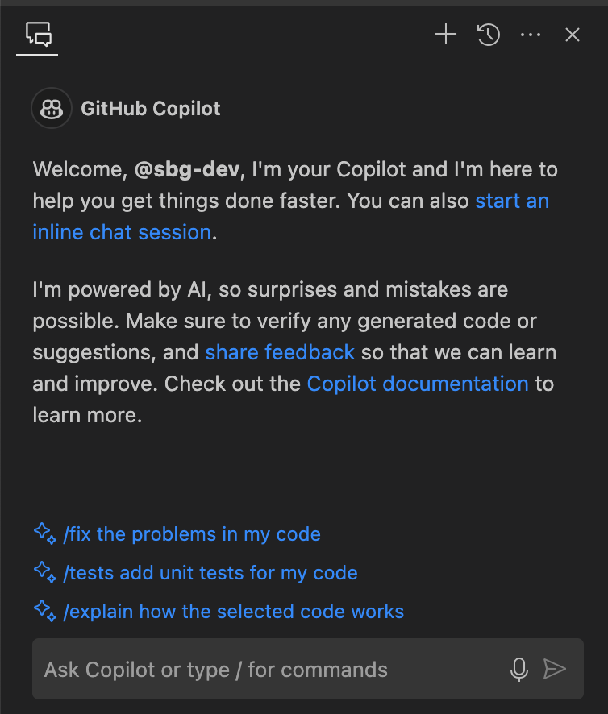
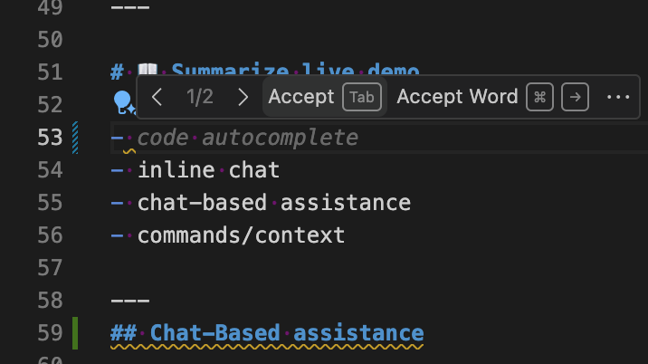
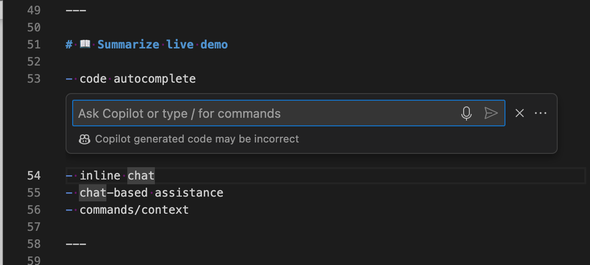
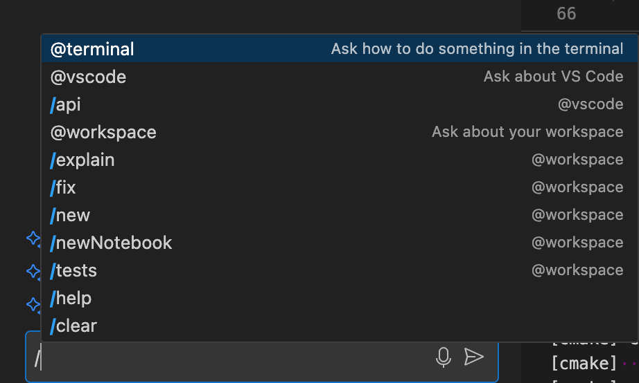
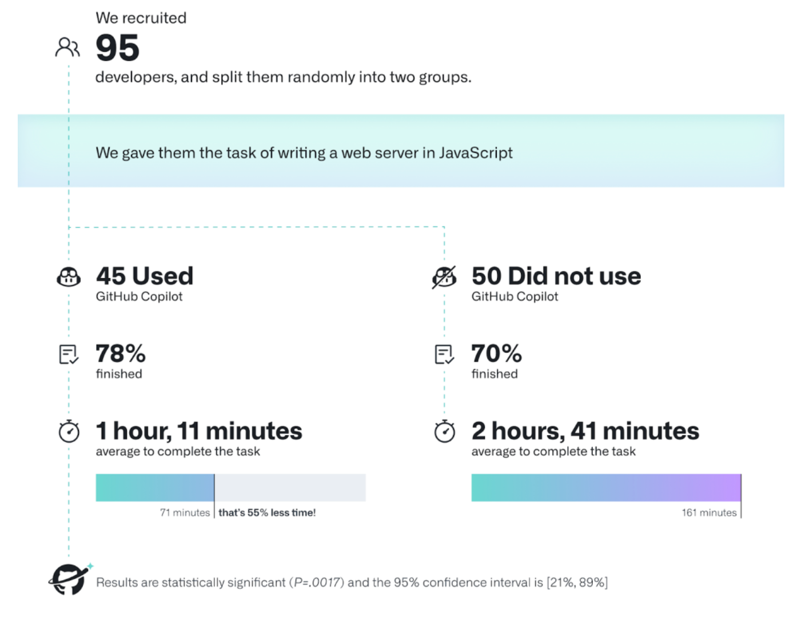

<!-- _header: "" -->

# 🚀 AI-Assisted Coding an introduction
### by Raoul Nottrott & Sebastian Gnip
### using GitHub Copilot

<!-- _footer: "" -->
<!-- _paginate: fasle -->

---

## Agenda

1. :technologist: Introduction to AI-assisted coding [30 - 45 min]
2. 📊 Facts and statistics
3. 🌐 Alternatives
4. 💰 Pricing
5. :speech_balloon: Discussion and Q&A

---
# Live Demo :technologist:

- Does this increase productivity?
- Will this reduce errors and bugs?
- Will you learn faster and onboard new developers faster?
- Will this enhance code quality and consistency?

<!-- Notes:
Please note: This is a live demo and the results may vary.
Questions: feel free to ask questions during the live demo.
-->
---

# 📖 Summarize live demo

---
## Chat-Based assistance

---
## Code completion

---

## Inline chat

---

## Commands/Context

---

# 📊 Facts and statistics about Copilot

* Copilot is trained continuously on public code from GitHub and other sources
  * It includes our Basler Product Documentation 😁
* Copilot analyzes the context in the editor
  * include open files and dependencies
  * generate suggestions probabilistically
  * ❗ without copying local code

---
<!-- _header: "" -->

# :scientist: Study about GitHub Copilot

<!-- _footer: "https://github.blog/2022-09-07-research-quantifying-github-copilots-impact-on-developer-productivity-and-happiness/" -->

---

# 🌐 Alternatives

- **Codeium**
- Tabnine
- CodeWhisperer (Amazon)
- ML-enhanced code completion (Google)
- **ChatGPT** (OpenAI)
- **Copilot** (Microsoft)

[9 Free and Paid GitHub Copilot alternatives in 2024](https://www.tabnine.com/blog/github-copilot-alternatives/)

<!-- Notes: 
Codeium is a code completion tool that uses AI to provide suggestions and automate repetitive tasks. It is available as a plugin for popular IDEs like Visual Studio Code and JetBrains.
- Some file types are not supported by Codeium, such as .json, .yml, and .md. It also has limited support for languages like Python and JavaScript.

Tabnine is an AI-powered code completion tool that integrates with popular IDEs like Visual Studio Code, JetBrains, and Atom. It uses a deep learning model to provide context-aware suggestions and automate repetitive tasks.

CodeWhisperer is an AI-powered code completion tool that uses machine learning to provide context-aware suggestions and automate repetitive tasks. It is available as a plugin for popular IDEs like Visual Studio Code and JetBrains.

ML-enhanced code completion is a feature in Google's Cloud Code IDE extension that uses machine learning to provide context-aware suggestions and automate repetitive tasks. It is available as a plugin for popular IDEs like Visual Studio Code and JetBrains.
-->
---

# 💰 Pricing for GitHub Copilot

- Copilot Individual 10$ a month/user (not for Business use)
- Copilot Business 19$ a month/user
- Copilot Enterprise 39$ a month/user

---

 # Discussion and Q&A :thought_balloon:

<!-- Notes:

GitHub Copilot is used by over 1 million individual developers and tens of thousands of businesses, including over 50,000 paying business customers. 

According to a 2023 Stack Overflow survey, 55% of developers prefer Copilot as an AI programming assistant.

Copilot analyzes the context in the editor, including open files and dependencies, to generate suggestions probabilistically without copying code. 

With Copilot Enterprise, companies can customize Copilot to their codebase and processes. This includes creating fine-tuned private models.

Copilot collects user data like interactions and prompts to improve the experience. Feedback can be voluntarily submitted.

The Copilot Trust Center describes GitHub's commitments to privacy, such as excluding enterprise data from training.

Regular blog posts provide information on Copilot research, customer stories, and AI trends for developers.

The overall goal of Copilot is to help developers code happier and faster by automating routine tasks and providing context-aware assistance.

- Copilot is trained continuously on public code from GitHub and other sources to improve its suggestions over time. However, it does not directly copy or store code.

- Suggestions are generated based on a probabilistic understanding of context rather than memorizing snippets. This allows Copilot to adapt to different codebases and styles.

- In addition to code completions, Copilot provides chat assistance directly in IDEs, terminals, and GitHub.com. Developers can ask questions about their codebase. 

- Copilot is designed to be helpful, harmless, and honest. It aims to avoid insecure or unethical suggestions through techniques like constitutional AI.

- GitHub does not use Copilot Business or Enterprise customer data to train models. Customer data is only used to operate and improve the paid services.

- Research shows using Copilot can significantly boost productivity, job satisfaction, and code quality while reducing bugs. It helps developers focus on higher-level work.

- Additional paid features in Copilot Enterprise include custom models, integrated chat on GitHub.com, and tailored documentation search.

- GitHub offers professional services like guided workshops to help organizations adopt Copilot and maximize its benefits.

- The Copilot product is continually expanding to more languages, platforms, and use cases based on customer and market feedback.
-->

---

# References

Sample code: [https://github.com/sbg-dev/introduction_copilot](https://github.com/sbg-dev/introduction_copilot)
GitHub Copilot: [https://copilot.github.com](https://copilot.github.com)
Quickstart GitHub Colipot: [https://docs.github.com/de/copilot/quickstart](https://docs.github.com/de/copilot/quickstart)
